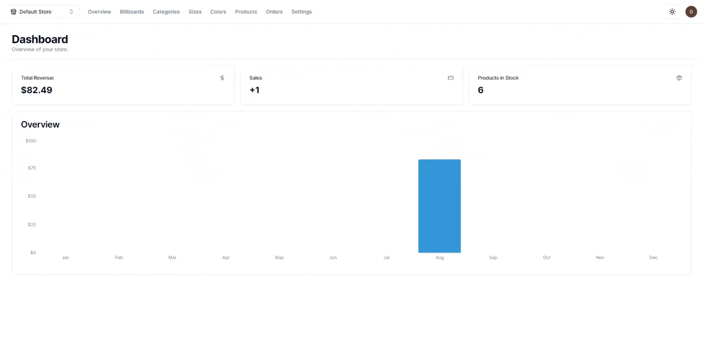

# app-ecommerce-2023

[](https://choosealicense.com/licenses/mit/)  

## _About_

**Name:** E-Commerce Website  
**Year:** 2023  
**Info:** [](https://dandelion-appeal-fd9.notion.site/app-ecommerce-2023-9bae8d6009524f0bba23f2f7e8fe2932)  
**Idea:** [](https://github.com/AntonioErdeljac)  
**Description:** Project e-commerce website divided into 2 parts (Admin and Store) with Authentication, Authorization, Easy editing of existing products and adding new ones, viewing open orders in the form of a convenient table and graphs, payment processing through the Stripe system and much more.  
**Deploy:** [](https://vercel.com/)  
**Admin:** https://app-ecommerce-2023-admin.vercel.app/  
**Store:** https://app-ecommerce-2023-store.vercel.app/  

## _Tech stack_

[](https://nodejs.org/)
[](https://www.typescriptlang.org/) 
[](https://nextjs.org/) 
[](https://legacy.reactjs.org/) 
[](https://tailwindcss.com/) 
[](https://planetscale.com/) 
[](https://www.prisma.io/) 
[](https://stripe.com/) 
[](https://cloudinary.com/) 
[](https://eslint.org/) 
[](https://prettier.io/) 
[](https://ui.shadcn.com/) 
[](https://clerk.com/) 
[](https://zustand-demo.pmnd.rs/) 
[](https://recharts.org/en-US/)  

## _Store_

[](https://app-ecommerce-2023-store.vercel.app/)  

_Preview:_ 


## _Admin_

[](https://app-ecommerce-2023-admin.vercel.app/)  

_Preview:_ 


## _Workflow_

- [x] Introduction
- [x] Environment setup (Admin)
- [x] Clerk Authentication (Admin)
- [x] Modal components (Admin)
- [x] Form components (Admin)
- [x] Prisma, PlanetScale, MySQL setup (Admin)
- [x] Dashboard setup (Admin)
- [x] Navigation bar (Admin)
- [x] Settings page (Admin)
- [x] Billboards Entity (Admin)
- [x] Data Table (Admin)
- [x] Categories Entity (Admin)
- [x] Sizes Entity (Admin)
- [x] Colors Entity (Admin)
- [x] Products Entity (Admin)
- [x] Orders Entity (Admin)
- [x] Environment setup & featured products (Store)
- [x] Individual product screen (Store)
- [x] Individual category screen (Store)
- [x] Product preview modal components (Store)
- [x] Add to Cart functionality (Store)
- [x] Stripe Setup & Checkout finalization (Admin, Store)  
- [x] Dashboard page (Admin)
- [x] Dark Mode (Admin)
- [x] Deployment to Vercel (Admin, Store)

## _API Reference_

### Stores

#### Create store
```http
  POST /api/stores
```

| Parameter | Type     | Description |
| :-------- | :------- | :-------------------------------- |
| `userId`  | `auth`   | **Required**. User auth from Clerk. |

#### Update store
```http
  PATCH /api/stores/${storeId}
```

| Parameter | Type     | Description                       |
| :-------- | :------- | :-------------------------------- |
| `userId`  | `auth`   | **Required**. User auth from Clerk. |
| `storeId` | `string` | **Required**. Id of the store to be updated. |

| Data | Type | Description |
| :--- | :--- | :---------- |
| `name` | `string` | **Required**. Store name. |

#### Delete store
```http
  DELETE /api/stores/${storeId}
```

| Parameter | Type     | Description                       |
| :-------- | :------- | :-------------------------------- |
| `userId`  | `auth`   | **Required**. User auth from Clerk. |
| `storeId` | `string` | **Required**. Id of the store to be deleted. |

### Billboards

#### Get all billboards
```http
  GET /api/${storeId}/billboards
```

| Parameter | Type     | Description                       |
| :-------- | :------- | :-------------------------------- |
| `storeId` | `string` | **Required**. Id of the store to be deleted. |

#### Create billboard
```http
  POST /api/${storeId}/billboards
```

| Parameter | Type     | Description                       |
| :-------- | :------- | :-------------------------------- |
| `userId`  | `auth`   | **Required**. User auth from Clerk. |
| `storeId` | `string` | **Required**. Id of the store to be deleted. |

| Data | Type | Description |
| :--- | :--- | :---------- |
| `label` | `string` | **Required**. Billboard label. |
| `imageUrl` | `string` | **Required**. Billboard image URL. |

#### Get billboard
```http
  GET /api/${storeId}/billboards/${billboardId}
```

| Parameter | Type     | Description                       |
| :-------- | :------- | :-------------------------------- |
| `storeId` | `string` | **Required**. Id of the store. |
| `billboardId` | `string` | **Required**. Id of the store billboard. |

#### Update billboard
```http
  POST /api/${storeId}/billboards/${billboardId}
```

| Parameter | Type     | Description                       |
| :-------- | :------- | :-------------------------------- |
| `userId`  | `auth`   | **Required**. User auth from Clerk. |
| `storeId` | `string` | **Required**. Id of the store. |
| `billboardId` | `string` | **Required**. Id of the store billboard to be updated. |

| Data | Type | Description |
| :--- | :--- | :---------- |
| `label` | `string` | **Required**. Billboard label. |
| `imageUrl` | `string` | **Required**. Billboard image URL. |

#### Delete billboard
```http
  DELETE /api/${storeId}/billboards/${billboardId}
```

| Parameter | Type     | Description                       |
| :-------- | :------- | :-------------------------------- |
| `userId`  | `auth`   | **Required**. User auth from Clerk. |
| `storeId` | `string` | **Required**. Id of the store. |
| `billboardId` | `string` | **Required**. Id of the store billboard to be deleted. |

### Categories

#### Get all categories
```http
  GET /api/${storeId}/categories
```

| Parameter | Type     | Description                       |
| :-------- | :------- | :-------------------------------- |
| `storeId` | `string` | **Required**. Id of the store. |

#### Create category
```http
  POST /api/${storeId}/categories
```

| Parameter | Type     | Description                       |
| :-------- | :------- | :-------------------------------- |
| `userId`  | `auth`   | **Required**. User auth from Clerk. |
| `storeId` | `string` | **Required**. Id of the store. |

| Data | Type | Description |
| :--- | :--- | :---------- |
| `name` | `string` | **Required**. Category name. |
| `billboardId` | `string` | **Required**. Billboard for this category. |

#### Get category
```http
  GET /api/${storeId}/categories/${categoryId}
```

| Parameter | Type     | Description                       |
| :-------- | :------- | :-------------------------------- |
| `storeId` | `string` | **Required**. Id of the store. |
| `categoryId` | `string` | **Required**. Id of the store category. |

#### Update category
```http
  PATCH /api/${storeId}/categories/${categoryId}
```

| Parameter | Type     | Description                       |
| :-------- | :------- | :-------------------------------- |
| `userId`  | `auth`   | **Required**. User auth from Clerk. |
| `storeId` | `string` | **Required**. Id of the store. |
| `categoryId` | `string` | **Required**. Id of the store category to be updated. |

| Data | Type | Description |
| :--- | :--- | :---------- |
| `name` | `string` | **Required**. Category name. |
| `billboardId` | `string` | **Required**. Billboard for this category. |

#### Delete category
```http
  DELETE /api/${storeId}/categories/${categoryId}
```

| Parameter | Type     | Description                       |
| :-------- | :------- | :-------------------------------- |
| `userId`  | `auth`   | **Required**. User auth from Clerk. |
| `storeId` | `string` | **Required**. Id of the store. |
| `categoryId` | `string` | **Required**. Id of the store category to be deleted. |

### Colors

#### Get all colors
```http
  GET /api/${storeId}/colors
```

| Parameter | Type     | Description                       |
| :-------- | :------- | :-------------------------------- |
| `storeId` | `string` | **Required**. Id of the store. |

#### Create color
```http
  POST /api/${storeId}/colors
```

| Parameter | Type     | Description                       |
| :-------- | :------- | :-------------------------------- |
| `userId`  | `auth`   | **Required**. User auth from Clerk. |
| `storeId` | `string` | **Required**. Id of the store. |

| Data | Type | Description |
| :--- | :--- | :---------- |
| `name` | `string` | **Required**. Color name display. |
| `value` | `string` | **Required**. Color value. |

#### Get color
```http
  GET /api/${storeId}/colors/${colorId}
```

| Parameter | Type     | Description                       |
| :-------- | :------- | :-------------------------------- |
| `storeId` | `string` | **Required**. Id of the store. |
| `colorId` | `string` | **Required**. Id of the store color. |

#### Update color
```http
  PATCH /api/${storeId}/colors/${colorId}
```

| Parameter | Type     | Description                       |
| :-------- | :------- | :-------------------------------- |
| `userId`  | `auth`   | **Required**. User auth from Clerk. |
| `storeId` | `string` | **Required**. Id of the store. |
| `colorId` | `string` | **Required**. Id of the store color to be updated. |

| Data | Type | Description |
| :--- | :--- | :---------- |
| `name` | `string` | **Required**. Color name display. |
| `value` | `string` | **Required**. Color value. |

#### Delete color
```http
  DELETE /api/${storeId}/colors/${colorId}
```

| Parameter | Type     | Description                       |
| :-------- | :------- | :-------------------------------- |
| `userId`  | `auth`   | **Required**. User auth from Clerk. |
| `storeId` | `string` | **Required**. Id of the store. |
| `colorId` | `string` | **Required**. Id of the store color to be deleted. |


### Sizes

#### Get all sizes
```http
  GET /api/${storeId}/sizes
```

| Parameter | Type     | Description                       |
| :-------- | :------- | :-------------------------------- |
| `storeId` | `string` | **Required**. Id of the store. |

#### Create size
```http
  POST /api/${storeId}/sizes
```

| Parameter | Type     | Description                       |
| :-------- | :------- | :-------------------------------- |
| `userId`  | `auth`   | **Required**. User auth from Clerk. |
| `storeId` | `string` | **Required**. Id of the store. |

| Data | Type | Description |
| :--- | :--- | :---------- |
| `name` | `string` | **Required**. Size name display. |
| `value` | `string` | **Required**. Size value. |

#### Get size
```http
  GET /api/${storeId}/sizes/${sizeId}
```

| Parameter | Type     | Description                       |
| :-------- | :------- | :-------------------------------- |
| `storeId` | `string` | **Required**. Id of the store. |
| `sizeId` | `string` | **Required**. Id of the store size. |

#### Update size
```http
  PATCH /api/${storeId}/sizes/${sizeId}
```

| Parameter | Type     | Description                       |
| :-------- | :------- | :-------------------------------- |
| `userId`  | `auth`   | **Required**. User auth from Clerk. |
| `storeId` | `string` | **Required**. Id of the store. |
| `sizeId` | `string` | **Required**. Id of the store size to be updated. |

| Data | Type | Description |
| :--- | :--- | :---------- |
| `name` | `string` | **Required**. Size name display. |
| `value` | `string` | **Required**. Size value. |

#### Delete size
```http
  DELETE /api/${storeId}/sizes/${sizeId}
```

| Parameter | Type     | Description                       |
| :-------- | :------- | :-------------------------------- |
| `userId`  | `auth`   | **Required**. User auth from Clerk. |
| `storeId` | `string` | **Required**. Id of the store. |
| `sizeId` | `string` | **Required**. Id of the store size to be deleted. |

### Products

#### Get all products
```http
  GET /api/${storeId}/products
```

| Parameter | Type     | Description                       |
| :-------- | :------- | :-------------------------------- |
| `storeId` | `string` | **Required**. Id of the store. |
| `categoryId` | `string` | Filter by store category Id. |
| `colorId` | `string` | Filter by store color Id. |
| `sizeId` | `string` | Filter by store size Id. |
| `isFeatured` | `boolean` | Filter by store isFeatured value. |

#### Create product
```http
  POST /api/${storeId}/products
```

| Parameter | Type     | Description                       |
| :-------- | :------- | :-------------------------------- |
| `userId`  | `auth`   | **Required**. User auth from Clerk. |
| `storeId` | `string` | **Required**. Id of the store. |

| Data | Type | Description |
| :--- | :--- | :---------- |
| `name` | `string` | **Required**. Product name. |
| `price` | `string` | **Required**. Product price. |
| `categoryId` | `string` | **Required**. Product category id. |
| `colorId` | `string` | **Required**. Product color id. |
| `sizeId` | `string` | **Required**. Product size id. |
| `images` | `[{url:string}]` | **Required**. Array with image Url(s). |
| `isFeatured` | `boolean` | **Required**. Boolean value whether to display the product on the main page. |
| `isArchived` | `boolean` | **Required**. Boolean importance of whether to archive this product. |

#### Get product
```http
  GET /api/${storeId}/products/${productId}
```

| Parameter | Type     | Description                       |
| :-------- | :------- | :-------------------------------- |
| `storeId` | `string` | **Required**. Id of the store. |
| `productId` | `string` | **Required**. Id of the store product. |

#### Update product
```http
  PATCH /api/${storeId}/products/${productId}
```

| Parameter | Type     | Description                       |
| :-------- | :------- | :-------------------------------- |
| `userId`  | `auth`   | **Required**. User auth from Clerk. |
| `storeId` | `string` | **Required**. Id of the store. |
| `productId` | `string` | **Required**. Id of the store product to be updated. |

| Data | Type | Description |
| :--- | :--- | :---------- |
| `name` | `string` | **Required**. Product name. |
| `price` | `string` | **Required**. Product price. |
| `categoryId` | `string` | **Required**. Product category id. |
| `colorId` | `string` | **Required**. Product color id. |
| `sizeId` | `string` | **Required**. Product size id. |
| `images` | `[{url:string}]` | **Required**. Array with image Url(s). |
| `isFeatured` | `boolean` | **Required**. Boolean value whether to display the product on the main page. |
| `isArchived` | `boolean` | **Required**. Boolean importance of whether to archive this product. |

#### Delete product
```http
  DELETE /api/${storeId}/products/${productId}
```

| Parameter | Type     | Description                       |
| :-------- | :------- | :-------------------------------- |
| `userId`  | `auth`   | **Required**. User auth from Clerk. |
| `storeId` | `string` | **Required**. Id of the store. |
| `productId` | `string` | **Required**. Id of the store product to be deleted. |

### Checkout

#### Get header options
```http
  OPTIONS /api/${storeId}/checkout
```

| Parameter | Type     | Description                       |
| :-------- | :------- | :-------------------------------- |
| `storeId` | `string` | **Required**. Id of the store. |

#### Create invoice
```http
  POST /api/${storeId}/checkout
```

| Parameter | Type     | Description                       |
| :-------- | :------- | :-------------------------------- |
| `storeId` | `string` | **Required**. Id of the store. |
| `invoice` | `Stripe object` | **Required**. Stripe invoce object. |

### Webhook

#### Stripe Webhook

```http
  POST /api/webhook
```


## _ASCII_
     .d8b.  d8888b. d8888b.        d88888b  .o88b.  .d88b.  .88b  d88. .88b  d88. d88888b d8888b.  .o88b. d88888b        .d888b.  .d88b.  .d888b. d8888b. 
    d8' `8b 88  `8D 88  `8D        88'     d8P  Y8 .8P  Y8. 88'YbdP`88 88'YbdP`88 88'     88  `8D d8P  Y8 88'            VP  `8D .8P  88. VP  `8D VP  `8D 
    88ooo88 88oodD' 88oodD'        88ooooo 8P      88    88 88  88  88 88  88  88 88ooooo 88oobY' 8P      88ooooo           odD' 88  d'88    odD'   oooY' 
    88~~~88 88~~~   88~~~   C8888D 88~~~~~ 8b      88    88 88  88  88 88  88  88 88~~~~~ 88`8b   8b      88~~~~~ C8888D  .88'   88 d' 88  .88'     ~~~b. 
    88   88 88      88             88.     Y8b  d8 `8b  d8' 88  88  88 88  88  88 88.     88 `88. Y8b  d8 88.            j88.    `88  d8' j88.    db   8D 
    YP   YP 88      88             Y88888P  `Y88P'  `Y88P'  YP  YP  YP YP  YP  YP Y88888P 88   YD  `Y88P' Y88888P        888888D  `Y88P'  888888D Y8888P' 


## License

[MIT](https://choosealicense.com/licenses/mit/)
